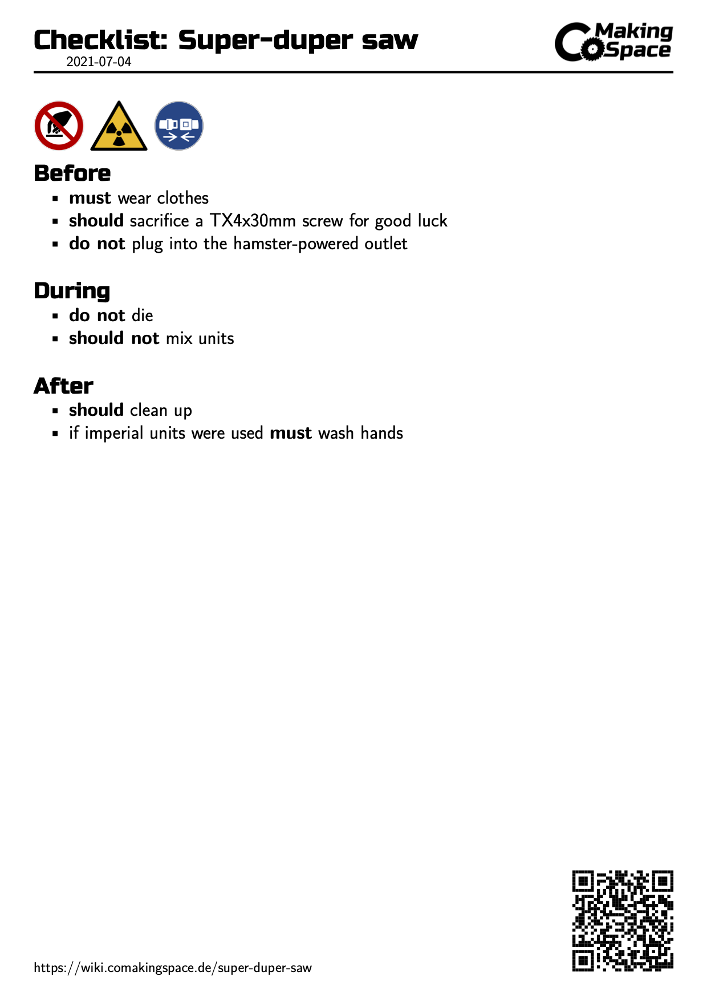

# Machine Checklists
As part of our machine documentation at the CoMakingSpace we have short checklists next to the machines, that serve as a quick reminder of the usage and dangers of the corresponding equipment. 
The checklists contain do/don't/warning symbols at the top based on ISO7010; pre/during/post usage notes and a link to the wiki page of the machine.

The PDFs are autogenerated by github actions from markdown files using [pandoc](https://pandoc.org) with a custom latex template. The markdown files are generated by scraping our [wiki](www.wiki.comakingspace.de) for semantic media wiki properties.

## Checklist Syntax
Each checklist markdown has a YAML metadata block at the top that defines the variables (like links, ISO7010 symbols etc.) needed for generating the PDF.

```YAML
---
checklist_title: "Super-duper saw" # name of the machine
checklist_link:  "https://wiki.comakingspace.de/super-duper-saw" # link to the wikipage for further information
checklist_symbols:   # do/don't/warning symbols ISO7010
  - P010 # don't touch my saw
  - W003 # my saw may be radioactive
  - M020 # do wear a seatbelt while using the saw
---
```

After the metadata block there should be three sections with **short** notes on things to do before/during/after using the machine. To keep it inline with our wiki documentation, try to use the [MoSCoW method](https://en.wikipedia.org/wiki/MoSCoW_method) for those notes.

```markdown
# Before
* **must** wear clothes
* **should** sacrifice a TX4x30mm screw for good luck
* **do not** plug into the hamster-powered outlet

# During
* **must not** die
* **should not** mix units

# After
* **should** clean up
* if imperial units were used **must** wash hands
```

### Final result:



Each time a PDF is build it is tagged with the current date (and version?) to be able to tell the most recent document.

## Semantic wiki parsing
**ToDo**

## Autobuild with Github Actions

~~ToDo~~
